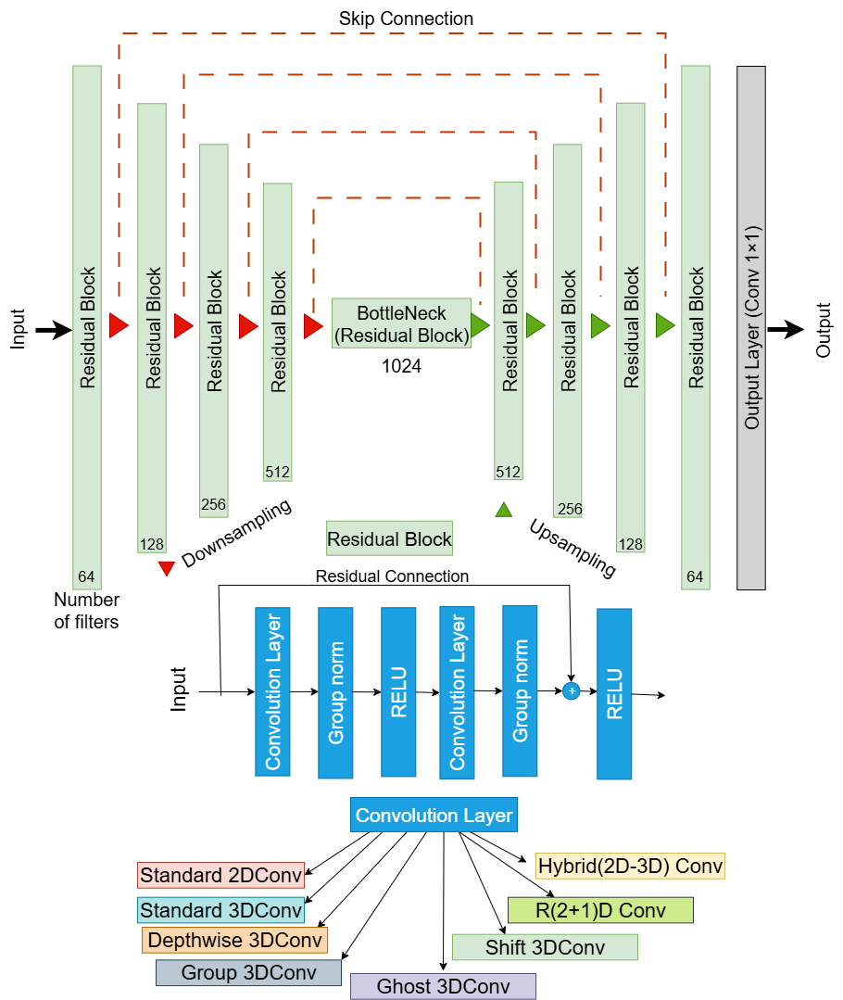

# 🌧️ Efficient 3D Convolutional Architectures for Radar-Based Rainfall Nowcasting

This repository provides code for the paper:

**"An Efficient 3D Convolutional Framework for Rainfall Nowcasting: Performance–Efficiency Trade-offs and Adaptation to Data Scarcity"**

This study proposes and compares multiple efficient 3D convolutional designs for rainfall nowcasting, focusing on accuracy–efficiency trade-offs and robustness.  
The tested variants include:

- Standard 3D convolution  
- Depthwise 3D convolution  
- Group 3D convolution
- Ghost 3D convolution
- Shift 3D convolution
- R(2+1)D convolution  
- Hybrid convolution (mixed standard 2D + 3D)

All models share a unified 3D Residual U-Net-based architecture and are trained, validated, and evaluated on five years (2016–2020) of UK radar data at 5-minute intervals and 1 km resolution (grid size: 512 × 512).

The models use a consistent 4-frame input / 12-frame output configuration in a sequence-to-sequence setting, enabling direct comparison of computational complexity, runtime, and predictive skill.

📄 See below for instructions on running the models. For further details, please refer to the paper or contact the author.

## 📁 Project Structure

**Efficient3DNowcasting**
- `run_predictions.py` — Main evaluation script  
- `utils.py` — Data loading, preprocessing, plotting, inference  
- `metrics.py` — MAE, RMSE, CSI metric functions  
- `sequence_builder.py` — Build rainfall sequences  
- `models/` — 3D U-Net and efficient convolutional variants  
- `checkpoints/` — Pretrained weights for each model variant  
- `sample_data/` — Sample radar sequences for testing  
- `requirements.txt` — pip environment  
- `environment.yml` — conda environment  
- `README.md` — Project documentation

## 💻 Setup & Requirements

**1) Clone the repository**

git clone https://github.com/Ahmed-HydroAI/Efficient3DNowcasting.git

cd Efficient3DNowcasting

**2) Install required packages**

Using pip:

pip install -r requirements.txt

Using conda (recommended for reproducibility):

conda env create -f environment.yml

conda activate efficientnowcast-env

**3) Download pretrained model checkpoints**

## 🚀 Usage

Run evaluation on all model variants:

bash

python run_predictions.py

This will run inference on the provided sample radar sequences and save outputs in the outputs/ directory.

## 📊 Outputs and Visualization
The script generates:

✅ Side-by-side plots of predicted vs observed rainfall

✅ MAE, RMSE, and CSI scores over lead times

✅ CSI curves for multiple rainfall thresholds

✅ Runtime and FLOP analysis (if ptflops is installed)

## 📄 License

This project is licensed under the Creative Commons Attribution 4.0 International (CC BY 4.0).
See the LICENSE file for details.

## 📬 Contact
For questions or collaborations, contact:

Ahmed Abdelhalim

University of Bristol

✉️ ahmed.abdelhalim@bristol.ac.uk

✉️ ahmed_abdelhalim@mu.edu.eg

🔗 https://github.com/Ahmed-HydroAI
